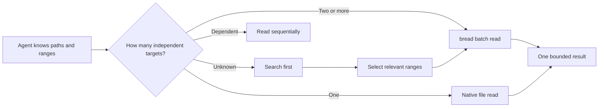

# bread

[](https://github.com/HuakunShen/bread/actions/workflows/ci.yml)
[](https://github.com/HuakunShen/bread/releases)
[](https://pkg.go.dev/github.com/HuakunShen/bread)
[](LICENSE)

> Read the context you already know, in one bounded turn.

`bread` is a small, dependency-free Go CLI for reading multiple known files or
line ranges as one deterministic result. Independent file I/O runs concurrently,
output keeps request order, and budgets prevent accidental context floods.

**[简体中文 README](README.zh-CN.md)** · **[Documentation site](https://huakunshen.github.io/bread/)** · **[Latest release](https://github.com/HuakunShen/bread/releases/latest)**

## Why bread?

When an agent already knows it needs `a.go`, `b.go`, and a test file, reading
them in three separate model turns adds latency and repeats conversation context.
`bread` makes that intent explicit:



This is a round-trip optimization, not a license to read everything. The included
[efficient-codebase-navigation](skills/efficient-codebase-navigation/SKILL.md)
skill teaches an agent when to batch and when to stay sequential.

## Features

- Multiple positional file requests: `path`, `path:start`, `path:start-end`
- JSON requests for unambiguous paths and ranges
- 1-based inclusive ranges with original line numbers
- Concurrent reads with deterministic input ordering
- Per-file line limits and an aggregate byte budget
- Text and structured JSON output
- Partial results for missing, binary, or invalid-UTF-8 files
- SHA-256 verified self-upgrade from GitHub Releases
- Release archives for macOS, Linux, and Windows on amd64 and arm64
- No third-party Go runtime dependencies

## Install

### With Go

```bash
go install github.com/HuakunShen/bread/cmd/bread@latest
```

Make sure `$(go env GOPATH)/bin` or `$(go env GOBIN)` is on your `PATH`.

### macOS or Linux without Go

```bash
curl -fsSL https://raw.githubusercontent.com/HuakunShen/bread/main/install.sh | bash
```

The installer places the binary in `~/.local/bin` by default. Set
`BREAD_INSTALL_DIR` to choose another directory. It verifies
`checksums.txt` before installing.

### Windows without Go

Run PowerShell:

```powershell
irm https://raw.githubusercontent.com/HuakunShen/bread/main/install.ps1 | iex
```

The default location is `%LOCALAPPDATA%\bread\bin`. Pass `-InstallDir` or set
`$env:BREAD_INSTALL_DIR` to change it.

### Homebrew

The immediately available tap path is:

```bash
brew install HuakunShen/tap/bread
```

This fully qualified command automatically adds `HuakunShen/tap` and trusts only
the `bread` formula. On Homebrew versions that require explicit trust, use:

```bash
brew tap HuakunShen/tap
brew trust --formula HuakunShen/tap/bread
brew install bread
```

The tap is the correct distribution boundary for a prebuilt CLI. A plain
`brew install bread` without a tap requires a separate formula pull request
accepted into `Homebrew/homebrew-core`; upstream cannot merge that formula
automatically.

## Upgrade

Use the CLI's own subcommand:

```bash
bread upgrade --check
bread upgrade
```

`bread upgrade` fetches the latest stable GitHub Release, selects the current
OS/architecture archive, verifies its SHA-256 checksum, extracts only the
`bread` executable, and replaces the installed binary. Unix replacement is
atomic. Windows schedules a retrying helper so the running executable can exit
before it is replaced.

`go upgrade` cannot be implemented by a Go module: `go` is a separate
executable owned by the Go toolchain. The supported command is `bread upgrade`.

## Usage

Read several targeted ranges:

```bash
bread \
  internal/read/request.go:1-120 \
  internal/read/reader.go:1-220 \
  internal/read/reader_test.go:1-160
```

Useful flags:

| Flag | Default | Purpose |
| --- | ---: | --- |
| `--format text\|json` | `text` | Human-readable or structured output |
| `--max-lines N` | `2000` | Per-file line limit; `0` is unlimited |
| `--max-bytes N` | `200000` | Aggregate content-byte limit; `0` is unlimited |
| `--no-line-numbers` | off | Omit line prefixes from text output |
| `--request FILE` | none | Read JSON from a file or `-` for stdin |
| `--version` | off | Print the build version |

JSON input:

```json
{
  "files": [
    {"path": "internal/read/request.go", "start": 1, "end": 120},
    {"path": "internal/read/render.go", "start": 1, "end": 100}
  ]
}
```

```bash
bread --format json --request request.json
```

Exit status is `0` when every file succeeds, `1` when at least one file has a
read error, and `2` for invalid flags or malformed input.

## Supported release targets

| OS | Intel/x86-64 | ARM 64-bit |
| --- | :---: | :---: |
| macOS | ✓ | ✓ |
| Linux | ✓ | ✓ |
| Windows | ✓ | ✓ |

## CI/CD and releases

The repository contains workflows for CI on Ubuntu/macOS/Windows, tag-driven
GoReleaser archives and checksums, GitHub Pages deployment from `site/`, and
optional Homebrew tap publication after a Release is published.

To cut a release after the GitHub repository is connected:

```bash
git tag v0.2.0
git push origin v0.2.0
```

The tag workflow publishes six archives and `checksums.txt`. The Pages workflow
uses the `github-pages` environment. The Homebrew workflow publishes `bread.rb`
after a Release is published. It uses a `HOMEBREW_TAP_TOKEN` secret that can
write only to `HuakunShen/homebrew-tap`; forks should set
`HOMEBREW_TAP_ENABLED=true` only after configuring that secret.

## Install the navigation skill

Install the repository's skill with the Skills CLI:

```bash
npx skills@latest add HuakunShen/bread
```

The skill is also readable directly at
[skills/efficient-codebase-navigation/SKILL.md](skills/efficient-codebase-navigation/SKILL.md).
It tells agents:

- unknown paths → search first;
- one known target → normal read;
- multiple independent targets → `bread` or one parallel read turn;
- dependent targets → sequential read.

## Development

```bash
go test ./...
go test -race ./...
go vet ./...
gofmt -l .
go build ./cmd/bread
```

The implementation deliberately does not include MCP, AST/LSP lookup, repository
search, editing, token counting, or a daemon. Those are separate features with
separate acceptance criteria.

## Security

The updater never installs an archive before verifying its SHA-256 entry from the
separately downloaded release checksum file. It rejects archive traversal and
symlink entries, extracts only the expected executable, and uses temporary files
for the download. Review the installer source before using it in a production
image.

## License

MIT
