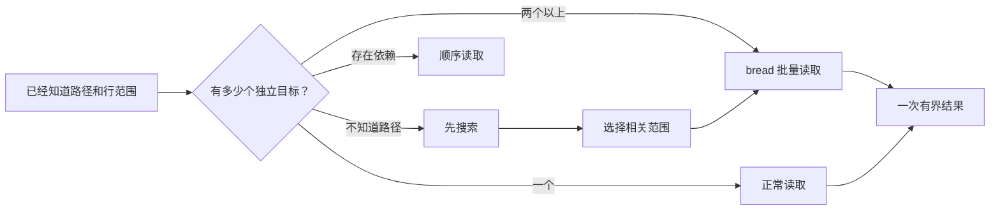

# bread

[](https://github.com/HuakunShen/bread/actions/workflows/ci.yml)
[](https://github.com/HuakunShen/bread/releases)
[](https://pkg.go.dev/github.com/HuakunShen/bread)
[](LICENSE)

> 在一次有界的读取中，拿到你已经知道的代码上下文。

`bread` 是一个小型、无第三方运行时依赖的 Go CLI，专门把多个已经知道
的文件或代码行范围一次读取出来。独立文件会并行读取，结果仍按请求顺序
输出，并且通过行数/字节数限制避免把无关内容灌入 Agent 上下文。

**[English README](README.md)** · **[文档网站](https://huakunshen.github.io/bread/)** · **[最新 Release](https://github.com/HuakunShen/bread/releases/latest)**

## 为什么需要 bread？

当 Agent 已经知道需要读取 `a.go`、`b.go` 和一个测试文件时，逐个读取会产生
多个模型往返，并重复携带之前的上下文。`bread` 把这个意图变成一次有界结果：



## 功能

- 支持 `path`、`path:start`、`path:start-end`
- 支持 JSON 请求，避免复杂路径的命令行歧义
- 行号从 1 开始，范围两端都包含
- 独立文件并行读取，但输出顺序稳定
- 每个文件行数限制和整个 batch 的字节限制
- 文本输出与结构化 JSON 输出
- 某个文件失败时保留其它成功结果
- 从 GitHub Release 下载并校验 SHA-256 后自升级
- 内置 Agent Skill，可用 `bread skill --add` 安装
- macOS、Linux、Windows 的 amd64 和 arm64 Release

## 安装

### 有 Go 环境

```bash
go install github.com/HuakunShen/bread/cmd/bread@latest
```

确保 `$(go env GOPATH)/bin` 或 `$(go env GOBIN)` 已加入 `PATH`。

### macOS/Linux，无 Go 环境

```bash
curl -fsSL https://raw.githubusercontent.com/HuakunShen/bread/main/install.sh | bash
```

默认安装到 `~/.local/bin`。可通过 `BREAD_INSTALL_DIR` 指定其它目录。

### Windows，无 Go 环境

在 PowerShell 中执行：

```powershell
irm https://raw.githubusercontent.com/HuakunShen/bread/main/install.ps1 | iex
```

默认安装到 `%LOCALAPPDATA%\bread\bin`，也可传入 `-InstallDir`。

### Homebrew

推荐使用 fully-qualified formula：

```bash
brew install HuakunShen/tap/bread
```

这个命令会自动添加 `HuakunShen/tap`，并只信任 `bread` 这个 formula。
如果你的 Homebrew 要求显式信任，使用：

```bash
brew tap HuakunShen/tap
brew trust --formula HuakunShen/tap/bread
brew install bread
```

如果希望用户在完全没有 tap 的情况下直接执行 `brew install bread`，还需要
把公式提交到 `Homebrew/homebrew-core` 并通过审核；上游项目不能自动合并到
官方仓库。

## 自升级

```bash
bread upgrade --check
bread upgrade
```

Updater 会获取最新稳定 Release，选择当前系统/架构的压缩包，使用单独下载
的 SHA-256 校验文件验证，然后只提取 `bread` 可执行文件并替换当前安装。
Unix 使用原子替换；Windows 会安排重试 helper，等待当前进程退出后再替换。

Go 模块不能给 Go 官方的 `go` 可执行文件增加子命令，所以 `go upgrade`
无法由本项目实现。正确命令是 `bread upgrade`。

## 使用

```bash
bread \
  internal/read/request.go:1-120 \
  internal/read/reader.go:1-220 \
  internal/read/reader_test.go:1-160
```

范围从 1 开始且两端包含。默认每个文件最多返回 2000 行，整个 batch 最多返回
200000 个内容字节；使用 `--max-lines 0 --max-bytes 0` 可以取消限制。

JSON 请求：

```json
{
  "files": [
    {"path": "internal/read/request.go", "start": 1, "end": 120},
    {"path": "internal/read/render.go", "start": 1, "end": 100}
  ]
}
```

```bash
bread --format json --request request.json
```

退出码：全部成功为 `0`；至少一个文件失败为 `1`；参数或 JSON 错误为
`2`。

## 支持的平台

| 系统 | Intel/x86-64 | ARM 64 位 |
| --- | :---: | :---: |
| macOS | ✓ | ✓ |
| Linux | ✓ | ✓ |
| Windows | ✓ | ✓ |

## CI/CD 和 Release

仓库自动化覆盖：

- Pull Request 和 `main` push 在 Ubuntu、macOS、Windows 上执行 CI
- SemVer tag 驱动 GoReleaser，生成六个平台包和 checksum
- 从 `site/` 自动部署 GitHub Pages
- Release 发布后可自动更新 Homebrew tap

发布版本：

```bash
git tag v0.2.0
git push origin v0.2.0
```

Homebrew 自动发布默认关闭。配置仓库变量
`HOMEBREW_TAP_ENABLED=true`，并提供只允许写入
`HuakunShen/homebrew-tap` 的 `HOMEBREW_TAP_TOKEN` secret 后再启用。

## 安装导航 Skill

`bread` 内置了
[efficient-codebase-navigation](skills/efficient-codebase-navigation/SKILL.md)
Skill，直接用自身命令安装即可，不需要额外工具：

```bash
bread skill --add
```

默认是 **global 安装**：写入 `~/.agents/skills/`（通用 agents 目录），如果检测到
Claude Code 配置目录，再写入 `~/.claude/skills/`（或 `$CLAUDE_CONFIG_DIR/skills`）；
如果检测到 Codex 配置目录，还会写入 `~/.codex/skills/`（或 `$CODEX_HOME/skills`）。
只有希望把 Skill 跟着仓库提交时，才需要 project 安装：

```bash
bread skill --add --project          # 安装到 ./.agents/skills 和 ./.claude/skills
bread skill --add --target agents    # 只装通用 agents 目录
bread skill --add --target claude    # 只装 Claude Code 目录
bread skill --add --target codex     # 只装 Codex 目录
bread skill --add --dir DIR          # 指定 skills 目录
```

只查看内容、不安装：

```bash
bread skill
```

也可以用 Skills CLI 安装仓库里的 Skill：

```bash
npx skills@latest add HuakunShen/bread
```

它指导 Agent：

- 不知道路径 → 先搜索；
- 只知道一个目标 → 正常读取；
- 已知多个独立目标 → `bread` 或一次并行读取；
- 后一个目标依赖前一个结果 → 顺序读取。

## 开发

```bash
go test ./...
go test -race ./...
go vet ./...
gofmt -l .
go build ./cmd/bread
```

## 安全

Updater 会在安装前校验从 Release 单独下载的 SHA-256 文件，拒绝归档路径穿越
和 symlink，只提取预期可执行文件，并使用临时目录。使用安装脚本前请先阅读源码。

## 许可证

MIT
